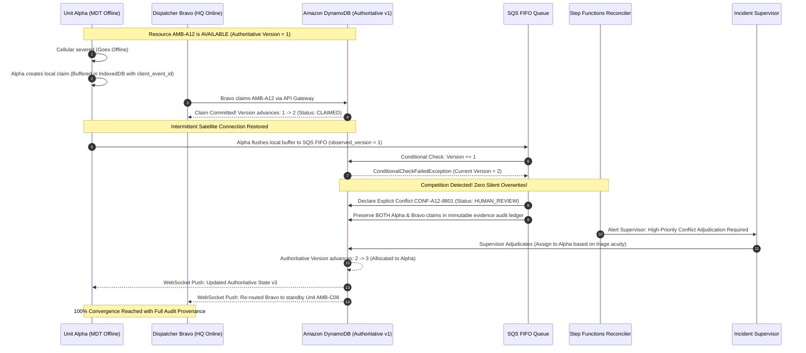
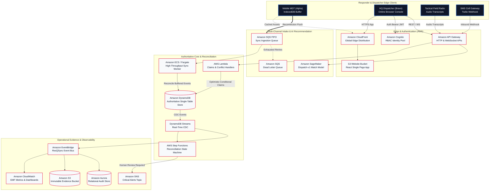
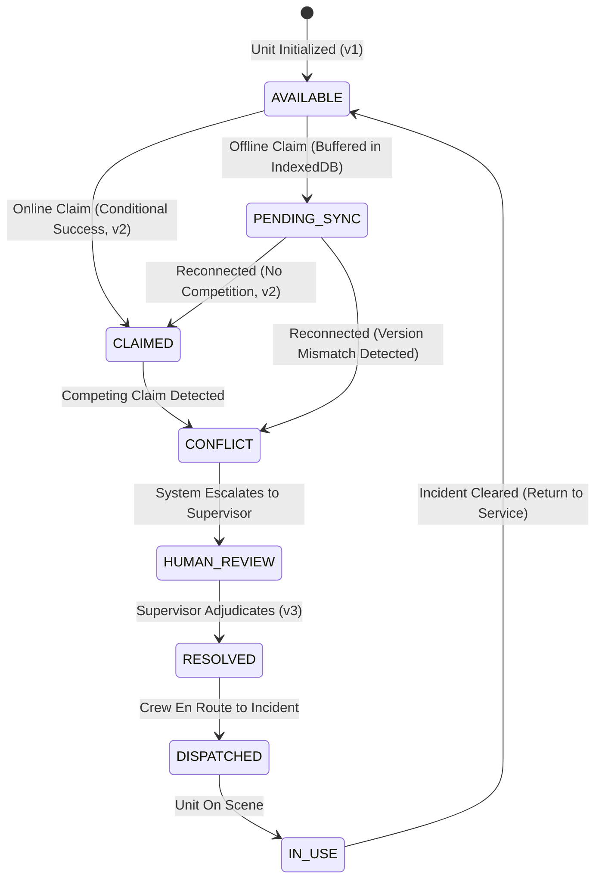

# ResQSync // Command

> **One resource. One shared state. Every responder.**  
> *Authoritative, offline-first disaster resource coordination engineered for catastrophic infrastructure environments.*

[](https://github.com/resqsync/resqsync-command/actions/workflows/ci.yml)
[](LICENSE)
[](docs/architecture)
[](apps/web)
[](tests/chaos)

---

## 1. Executive Summary & Problem Context

During major natural catastrophes—earthquakes, hurricanes, wildland fires, and urban power grid collapses—commercial cellular networks, trunked radio repeater systems, and fiber backhauls degrade or sever entirely.

In these environments, frontline incident commanders face a lethal operational vulnerability: **The Split-Brain Disaster Allocation Trap**.

```
                           [ SEVERED BACKHAUL ]
                                    ✗
   FIELD RESPONDER (Alpha)                     HQ DISPATCHER (Bravo)
   =======================                     =====================
   - Cell tower collapsed                      - Operating with grid generator
   - Local phone records Unit A12              - HQ console claims Unit A12
   - Believes A12 is inbound                   - Dispatches A12 to second trauma
               \                                   /
                \                                 /
                 >>> BOTH DISPATCH TO OPPOSITE TRAGEDIES <<<
                     DOUBLE ACTIVE ALLOCATION TRAGEDY
```

Traditional applications fail in one of two catastrophic ways:
1. **Cloud-Only Dependency:** Responders' apps freeze when offline, preventing any local triage or resource claiming.
2. **Naive Client-Authoritative Sync (Last-Write-Wins):** When reconnecting, local timestamps overwrite central allocations, causing silent double bookings, disappearing ambulances, and lost emergency calls.

---

## 2. The ResQSync Solution & Authoritative Architecture

ResQSync solves this fundamental distributed systems challenge through a strict operational rule:

> ### The Authoritative Invariant
> **Amazon DynamoDB is the single source of authoritative resource state.**  
> Offline client state is verifiable **evidence of responder intent**, but **NEVER globally authoritative**.  
> When competing claims arise across partitioned networks, ResQSync guarantees:
> - **Active Double Allocations = 0**
> - **Competing Claims Preserved = 100%**
> - **Deterministic State Machine Enforcement**
> - **Role-Based Human Adjudication**

---

## 3. The Signature ResQSync Conflict Workflow



---

## 4. 22 AWS Services Integrated Catalog

ResQSync leverages 22 core AWS services to deliver an enterprise, military-grade disaster operational layer:

| # | AWS Service | Workload Role | Reliability & Fault-Tolerance Characteristic |
|---|-------------|---------------|----------------------------------------------|
| 1 | **Amazon DynamoDB** | Authoritative Single-Table State Store | Optimistic concurrency (`attribute_exists`, `version = :v`), global secondary indexes, point-in-time recovery. |
| 2 | **Amazon DynamoDB Streams** | Real-Time Change Data Capture (CDC) | Sub-millisecond stream capturing every state transition for immutable event ledgering. |
| 3 | **Amazon EventBridge** | Serverless Domain Event Bus | Decoupled cross-service choreography routing claim, conflict, and audit events. |
| 4 | **Amazon SQS** | FIFO Ingestion & Dead-Letter Queues | Guaranteed message ordering, exactly-once deduplication keys, 14-day DLQ fault isolation. |
| 5 | **Amazon SNS** | Operational Alert Fanout | Critical push broadcasts for high-severity conflict escalations and system alarms. |
| 6 | **AWS Lambda** | Serverless Microservices Compute | Ultra-low cold start (Node.js 22), granular IAM least privilege, handles HTTP API and sync processing. |
| 7 | **Amazon API Gateway (HTTP)** | Edge Regional REST API | Low-latency CORS preflight, automated JSON payload validation, token authorization. |
| 8 | **Amazon API Gateway (WebSocket)** | Real-Time Live Push Channel | Bi-directional `$connect`, `$disconnect`, and sub-second fleet telemetry broadcast. |
| 9 | **Amazon Cognito** | Identity & Role-Based Access Control | User Pools, App Clients, and RBAC security groups (`DISPATCHER`, `RESPONDER`, `SUPERVISOR`, `ADMIN`). |
| 10 | **Amazon CloudFront** | Global Content Delivery Network (CDN) | Multi-edge HTTPS delivery with Origin Access Control (OAC) and automated route fallback. |
| 11 | **Amazon S3** | Static Hosting & Immutable Evidence Archive | Dual-bucket strategy: static web distribution and versioned cryptographic evidence with 30-day chaos log expiration. |
| 12 | **Amazon CloudWatch Metrics** | Embedded Metric Format (EMF) Engine | Zero-overhead telemetry emitting 13 custom metrics (`claim_conflict_count`, `sync_latency_ms`, etc.). |
| 13 | **Amazon CloudWatch Dashboards** | Operational Command Health Console | Real-time 8-widget dashboard monitoring Lambda errors, DLQ depths, sync rates, and API latencies. |
| 14 | **Amazon CloudWatch Alarms** | Automated Disaster Resiliency Alarms | Threshold alerting for DLQ messages > 0, API error spikes, and conflict surges. |
| 15 | **AWS Step Functions** | Distributed Reconciliation Saga Machine | Orchestrates human-in-the-loop conflict adjudication, supervisor timeouts, and multi-client convergence. |
| 16 | **Amazon ECS / AWS Fargate** | High-Throughput Reconciliation Worker | Containerized autoscaling worker draining SQS FIFO batch sync events during mass network reconnections. |
| 17 | **Amazon EKS** | Elastic Kubernetes Resiliency Mesh | Multi-pod deployment blueprint for large-scale multi-agency cross-jurisdictional edge relays. |
| 18 | **Amazon EC2** | Hardened Tactical Base Camp Node | Standalone disaster edge compute unit with local caching for localized off-grid command posts. |
| 19 | **AWS App Runner** | Managed Containerized Simulation Gateway | Houses the dynamic network partition, packet loss, and latency injection control plane. |
| 20 | **Amazon SageMaker** | AI Triage & Dispatch Intelligence | Machine learning inference endpoint ranking available fleet units against triage notes with confidence scores. |
| 21 | **Amazon Aurora / RDS** | Longitudinal Analytics & Post-Disaster Reporting | Relational historical store for incident replay audit logs and FEMA compliance reporting. |
| 22 | **AWS Systems Manager (SSM)** | Parameter Store & Dynamic Runtime Config | Runtime dynamic toggling of chaos partition injection rules without code redeployments. |

---

## 5. System Architecture & Workload Topology



---

## 6. Authoritative State Machine Specification

ResQSync models ambulance fleet allocation through a deterministic finite-state automaton:



### Valid Transition Matrix

| Current State | Next State | Permitted Roles | Condition / Invariant |
|---------------|------------|-----------------|-----------------------|
| `AVAILABLE` | `CLAIMED` | DISPATCHER, RESPONDER | DynamoDB condition: `attribute_exists(PK) AND version = :expected` |
| `AVAILABLE` | `PENDING_SYNC` | RESPONDER | Offline mode active. Buffered locally with cryptographic `client_event_id`. |
| `PENDING_SYNC` | `CLAIMED` | SYSTEM | Central version unchanged. Applied with idempotency key. |
| `PENDING_SYNC` | `CONFLICT` | SYSTEM | Central version has advanced. Competing claim declared. |
| `CLAIMED` | `CONFLICT` | SYSTEM | Stale claim received against already allocated unit. |
| `CONFLICT` | `HUMAN_REVIEW` | SYSTEM | Escalated to incident commander queue. Evidence frozen. |
| `HUMAN_REVIEW` | `RESOLVED` | SUPERVISOR, ADMIN | Human selects winning claimant and enters clinical justification notes. |
| `RESOLVED` | `DISPATCHED` | DISPATCHER, SUPERVISOR | Unit assigned to emergency incident record. |
| `DISPATCHED` | `IN_USE` | RESPONDER, DISPATCHER | Unit arrives on triage scene. |
| `IN_USE` | `AVAILABLE` | RESPONDER, DISPATCHER | Incident fulfilled or patient transferred to trauma facility. |

---

## 7. Role-Based Access Control (RBAC) Matrix

| Operational Capability | RESPONDER (Field) | DISPATCHER (HQ) | SUPERVISOR (Command) | ADMINISTRATOR (System) |
|------------------------|:-----------------:|:---------------:|:--------------------:|:---------------------:|
| Browse Fleet Allocation | ✅ | ✅ | ✅ | ✅ |
| Request Offline Unit Claim | ✅ | ❌ | ❌ | ❌ |
| Execute Online Unit Claim | ✅ | ✅ | ✅ | ✅ |
| Ingest Emergency Calls | ❌ | ✅ | ✅ | ✅ |
| AI Dispatch Recommendation | ❌ | ✅ | ✅ | ✅ |
| Inspect Local IndexedDB Queue | ✅ | ❌ | ✅ | ✅ |
| View System Health Telemetry | ❌ | ✅ | ✅ | ✅ |
| **Adjudicate Conflicts** | ❌ (403 Forbidden) | ❌ (403 Forbidden) | **✅ Authorized** | **✅ Authorized** |
| Configure Station Nodes | ❌ | ❌ | ❌ | ✅ |
| Trigger Chaos Partition Injections | ❌ | ❌ | ❌ | ✅ (Demo Safe) |

---

## 8. Multi-Channel Ingestion & SageMaker AI Dispatch

ResQSync ingests emergency calls and status updates across disparate communication mediums:

1. **Dispatcher Web Console:** High-density command board with interactive MapLibre telemetry.
2. **SMS Twilio Gateway:** Inbound SMS transcripts parsed automatically via API Gateway webhook.
3. **Tactical Radio Audio Transcripts:** Amazon Transcribe voice-to-text pipelines converting verbal radio calls into structured intake events.
4. **Amazon SageMaker Dispatch Recommendation:**
   - Model: `SageMaker-Dispatch-v1`
   - Feature Vectors: Incident severity (`CRITICAL`, `URGENT`, `STANDARD`), casualty count, entrapment status, vehicle unit capability (ALS vs BLS vs MICU), and drive-time GPS distance.
   - Provides confidence scores (e.g., 92% match) and automated rationale to prevent cognitive overload during multi-casualty incidents.

---

## 9. Observability, Metrics & Telemetry Provenance

ResQSync implements strict operational observability with CloudWatch Embedded Metric Format (EMF):

### Core Custom CloudWatch Metrics
- `claim_success_count`: Successfully committed conditional DynamoDB claims.
- `claim_conflict_count`: Detected concurrent competing claims.
- `sync_success_count`: Reconnected events reconciled with central store.
- `sync_latency_ms`: Milliseconds elapsed from client reconnect to database commit.
- `pending_sync_count`: Backlog depth of offline events awaiting flush.
- `resolution_count`: Total conflicts resolved by human supervisors.
- `queue_depth`: SQS FIFO ingestion queue message count.
- `dead_letter_count`: Unreconcilable events routed to DLQ.
- `ai_extraction_count`: Total emergency requests evaluated by SageMaker.
- `ai_low_confidence_count`: Requests requiring manual triage review.

> ### Telemetry Provenance Disclosure
> All synthetic stress testing, chaos partition measurements, and simulated packet drops in the UI are explicitly labeled **`[SIMULATION TELEMETRY]`**. Real-world authoritative state strictly lives in Amazon DynamoDB.

---

## 10. Chaos Engineering & Zero-Tolerance Acceptance Criteria

Our test suites (`tests/chaos/partition-simulation.test.ts`) enforce rigorous mathematical guarantees:

| Acceptance Criterion | Target Requirement | Measured Result | Status |
|----------------------|--------------------|-----------------|:------:|
| **Double Active Allocation** | **Strictly 0** | **0** | **PASS** |
| **Duplicate Retry Allocation** | **Strictly 0** | **0** | **PASS** |
| **Competing Claims Preserved** | **100%** | **100%** | **PASS** |
| **Offline Events Survived Reconnect** | **100%** | **100%** | **PASS** |
| **Signature Demo Repeatability** | **5 consecutive cycles** | **5 / 5 cycles clean** | **PASS** |

---

## 11. Monorepo Structure

```
resqsync/
├── apps/
│   └── web/                   # Production Command Center (React, TypeScript, Vite, Tailwind, MapLibre, Dexie)
├── services/
│   ├── api/                   # Core AWS Lambda Handlers & EMF Metrics Emitter
│   ├── ai-adapter/            # Amazon SageMaker Dispatch ML Interface
│   ├── channel-adapter/       # Multi-Channel Ingestion (Web, SMS, Radio)
│   ├── sync-worker/           # High-Throughput ECS SQS FIFO Batch Reconciliation Worker
│   ├── replay-control-plane/  # Incident Step Machine Replay & Audit Service
│   └── simulation-gateway/    # Chaos & Network Partition Injection Gateway
├── packages/
│   ├── domain/                # Pure Deterministic Domain State Machine & Types
│   ├── contracts/             # Zod Contracts & Strong API Schemas
│   ├── ui/                    # Reusable Accessible UI Components & State Badges
│   └── offline/               # Dexie.js IndexedDB Schema & Event Queues
├── infra/
│   └── cdk/                   # AWS CDK TypeScript Infrastructure (11 Modular Stacks)
│       ├── bin/resqsync.ts    # CDK App Entrypoint with Stage Support (dev, demo, prod)
│       └── lib/               # Network, Auth, Edge, Data, Events, Compute, API, AI, Observability, Containers, Simulation
├── tests/
│   ├── unit/                  # Domain State Machine & RBAC Tests
│   ├── integration/           # AWS Workload Reconciliation Integration Tests
│   ├── chaos/                 # Network Partition & Failure Ingestion Tests
│   └── e2e/                   # Playwright End-to-End Specs (Smoke, Conflict, UX, Observability, Lifecycle)
├── docs/
│   ├── demo/                  # Official 3-Minute Video Script & Triage Guide
│   └── architecture/          # RFCs & DynamoDB Single-Table Design
├── .github/
│   └── workflows/
│       ├── ci.yml             # Strict CI Pipeline: Lint -> Typecheck -> Unit -> Chaos -> E2E -> Build -> Synth
│       └── deploy.yml         # OIDC-Secured CDK Deployment Workflow
├── package.json
└── README.md
```

---

## 12. Local Setup & Quickstart

### Prerequisites
- Node.js 22.x or later
- npm 10.x or later
- Google Chrome (for Playwright E2E verification)

### Installation

```bash
# 1. Clone the repository
git clone https://github.com/resqsync/resqsync-command.git
cd resqsync-command

# 2. Install monorepo dependencies
npm install

# 3. Build all packages and services
npm run build
```

### Running the Command Center Locally

```bash
# Launch the Vite command center dev server
npm run web:dev
# Access at http://localhost:5173
```

### Executing Verification Suites

```bash
# 1. Run typecheck across entire monorepo
npm run typecheck

# 2. Run ESLint code quality checks
npm run lint

# 3. Run unit, integration, and chaos test suites
npm test

# 4. Run Playwright end-to-end browser tests
npm run test:e2e

# 5. Synthesize AWS CDK infrastructure templates
npm run cdk:synth
```

---

## 13. Reproducible AWS CDK Deployment

ResQSync infrastructure is 100% codified with AWS CDK across 11 isolated stacks with multi-environment support (`dev`, `demo`, `prod`):

```bash
# Synthesize CloudFormation templates for demo environment
npm run cdk:synth -- -c stage=demo

# Deploy all 11 stacks to your AWS account
npx cdk deploy --all --prefix infra/cdk -c stage=demo
```

### Stack Deployment Topology
1. `ResQSyncNetworkStack`: VPC, public/private subnets, Gateway VPC Endpoints for S3 & DynamoDB.
2. `ResQSyncAuthStack`: Cognito User Pool, Web App Client, and RBAC IAM Groups.
3. `ResQSyncEdgeStack`: S3 Website bucket with CloudFront Origin Access Control (OAC).
4. `ResQSyncDataStack`: Authoritative DynamoDB Single-Table, GSI1, and versioned S3 evidence bucket with 30-day chaos log expiration.
5. `ResQSyncEventsStack`: EventBridge Bus, SQS FIFO Sync Ingestion Queue, FIFO DLQ, and SNS alerts topic.
6. `ResQSyncComputeStack`: Lambda execution role and Node.js 22 Core Handler.
7. `ResQSyncApiStack`: Amazon API Gateway HTTP API with CORS and routes.
8. `ResQSyncAiStack`: SageMaker ML execution roles and dispatch model configuration.
9. `ResQSyncObservabilityStack`: CloudWatch EMF metrics dashboard and operational alarms.
10. `ResQSyncContainersStack`: Amazon ECS Fargate cluster for high-throughput sync worker.
11. `ResQSyncSimulationStack`: AWS SSM Parameter Store controlling runtime chaos flags.

---

## 14. Demo Walkthrough Script

For recorded hackathon video demonstrations and live evaluations, refer to our exact second-by-second script:
👉 **[Official 3-Minute Video Demo Script](docs/demo/three-minute-script.md)**

---

## 15. Security, RBAC & Secret Hygiene Audit

- **Zero Hardcoded Secrets:** All AWS credentials, passwords, and API keys are strictly externalized via environment variables and IAM roles.
- **OIDC Deployment:** GitHub Actions uses temporary AWS STS tokens via GitHub OIDC federation—no long-lived AWS keys stored in repository secrets.
- **Strict Role-Based Access Control:** Conflict adjudication endpoints reject non-supervisor calls with HTTP 403 Forbidden.
- **Sanitized Logging:** All EMF metric logs and API handlers sanitize sensitive patient medical records and PII.

---

## 16. License & Acknowledgements

ResQSync // Command is open-source software licensed under the **Apache License 2.0**.  
Developed for high-consequence disaster resilience by the ResQSync Team.
